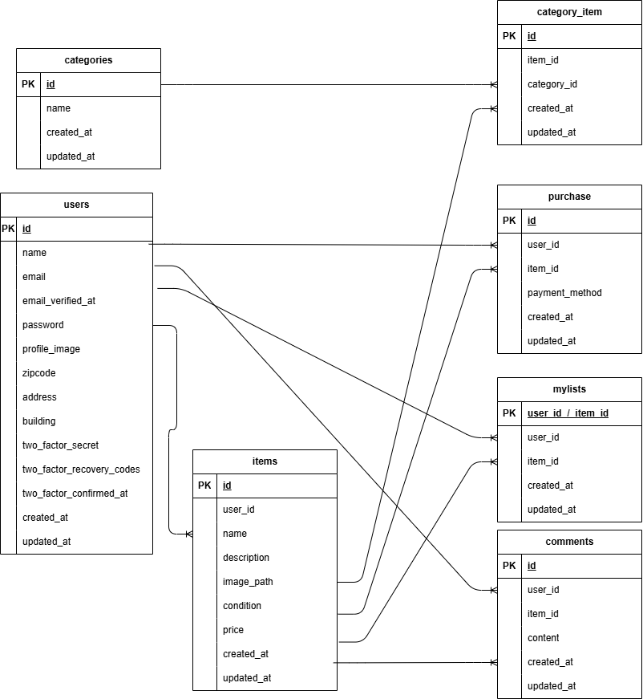

# 実践学習ターム模擬案件初級_フリマアプリ

## プロジェクト概要
本プロジェクトは、ユーザーが会員登録、ログイン、商品閲覧、購入、コメント、いいね機能などを利用できるECサイトです。  
Laravel Fortifyによる認証機能、メール認証、商品管理機能、コメント機能、Stripe連携による決済機能を実装しています。

---

## 環境構築

### 1. リポジトリをクローン
```bash
git clone https://github.com/your-repo.git
cd your-repo

```bash
git clone https://github.com/your-repo.git
cd your-repo
---

### 2. 依存パッケージをインストール
```bash
composer install
npm install
npm run dev
---

### 3. 環境変数を設定
```bash
cp .env.example .env

.env 内で以下を設定

DB接続情報

メール送信設定（mailhogまたはmailtrap推奨）

Stripeキー（STRIPE_KEY, STRIPE_SECRET）
---

### 4. アプリケーションションキーを生成
```bash
php artisan key:generate
---

### 5. コンテナを起動
```bash
docker compose up -d --build
---

### 6.マイグレーションと初期データ投入
```bash
docker exec -it app php artisan migrate --seed
---

## 使用技術
```bash
Laravel 10.x

Laravel Fortify（認証機能）

Laravel FormRequest（バリデーション）

mailhog / mailtrap（メール認証検証）

Tailwind CSS（フロントエンドスタイル）

MySQL 5.7以上

PHP 8.x

Node.js / npm

Stripe SDK（決済機能）
---

## 主な機能
```bash
会員登録（メール認証あり）

ログイン / ログアウト

商品一覧表示

購入済み商品は「Sold」表示

自分が出品した商品は非表示

マイリスト（いいねした商品一覧表示）

商品検索（部分一致）

商品詳細表示（コメント・いいね機能付き）

コメント投稿（ログインユーザーのみ）

商品購入（コンビニ / カード決済、Stripe連携）

プロフィール編集（画像・ユーザー名・住所変更）

商品出品（複数カテゴリ選択・画像アップロード）
---

## ER図


## URL
http://localhost


