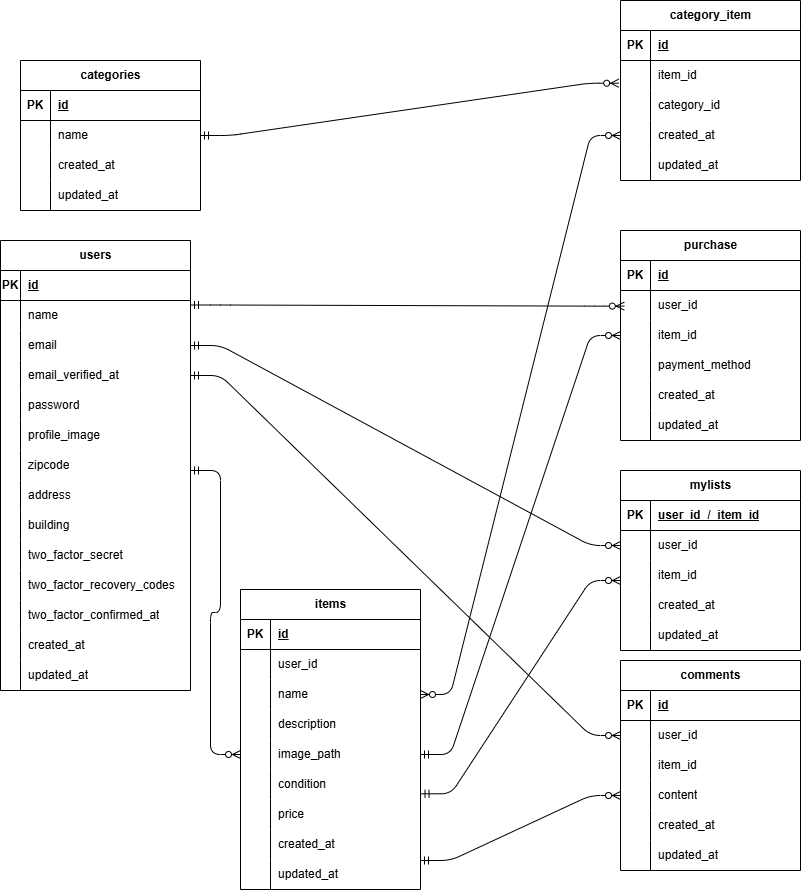

# 実践学習ターム模擬案件初級\_フリマアプリ

## プロジェクト概要

本プロジェクトは、ユーザーが会員登録、ログイン、商品閲覧、購入、コメント、いいね機能などを利用できる EC サイトです。  
Laravel Fortify による認証機能、メール認証、商品管理機能、コメント機能、Stripe 連携による決済機能を実装しています。
今回、比較していただきやすいようテストユーザーを二つ用意させていただきました。ご活用くださいませ。
1.　テストユーザー　test@example.com  pass:password
2.　未出品ユーザー　noitems@example.com　pass:password
テスト商品を10品出品したユーザーと全く出品していないユーザーになります。　

---

## 環境構築

```
リポジトリからダウンロード
git clone git@github.com:pao590/flea-market.git

```

.env ファイルの作成と設定
cp .env.example .env

```
DB_CONNECTION=mysql
DB_HOST=mysql
DB_PORT=3306
DB_DATABASE=laravel_db
DB_USERNAME=laravel_user
DB_PASSWORD=laravel_pass
```

Docker コンテナの構築と起動
docker-compose up -d --build
コンテナが起動できましたら、
docker ps
でphp、mysql、nginx、phpmyadmin、mailhog が起動していることを確認してください。
```

PHPコンテナ起動
docker-compose exec php bash
```

composer のインストール
composer install

```
アプリケーションキーの生成
php artisan key:generate

```

ストレージのシンボリック作成
php artisan storage:link

```
マイグレーションとシーディングの実行
php artisan migrate
php artisan db:seed

```

"The stream or file could not be opened"エラーが発生した場合 src ディレクトリにある storage ディレクトリ以下の権限を変更

chmod -R 777 storage

```
動作確認用URL
アプリ本体	http://localhost
phpMyAdmin	http://localhost:8080

```

## 使用技術

- PHP 7.4.9
- Laravel 8.83.29
- MySQL 8.0.26
- Docker 27.4.0
- Laravel Fortify（認証）

## テスト環境構築

```
テスト用データベースの作成
docker-compose exec mysql bash
mysql -u root -p

CREATE DATABASE demo_test;
SHOW DATABASES;

```
テスト用の.envファイルの作成
cp .env .env.testing

APP_ENV=test
APP_KEY=
DB_DATABASE=demo_test
DB_USERNAME=root
DB_PASSWORD=root
```
```
テスト用のテーブルの作成
docker-compose exec php bash
php artisan key:generate --env=testing
php artisan config:clear
php artisan migrate --env=testing
```

```
テストの実行
php artisan test

## トラブルシューティング

```
マイグレーションでエラーが起きた場合：
php artisan migrate:fresh --seed
を実行してデータベースをリセットし再構築してください
```
```
依存パッケージを変更したい・追加したい
composer install
こちらをPHPコンテナに入ってから実行してください
```

## 補足
```
- DockerとDocker Composeがインストールされている必要があります。
- docker-compose.yml により環境を起動します。
- マイグレーションは初回に必ず実行してください。
```

## ER 図


## URL
```
- 商品一覧：http://localhost/
- 商品詳細：http://localhost/item/{item_id}
- 会員登録：http://localhost/register
- ログイン：http://localhost/login
```

```
※ログイン必須URL
- 商品購入:http://localhost/purchase
- 配送先住所変更:http://localhost/purchase/address
- 商品出品:http://localhost/item/create
- マイリスト商品:http://localhost/mypages/mylist
- プロフィール:http://localhost/mypages
- プロフィール登録:http://localhost/mypages/setup
- プロフィール編集:http://localhost/mypages/profile
```
